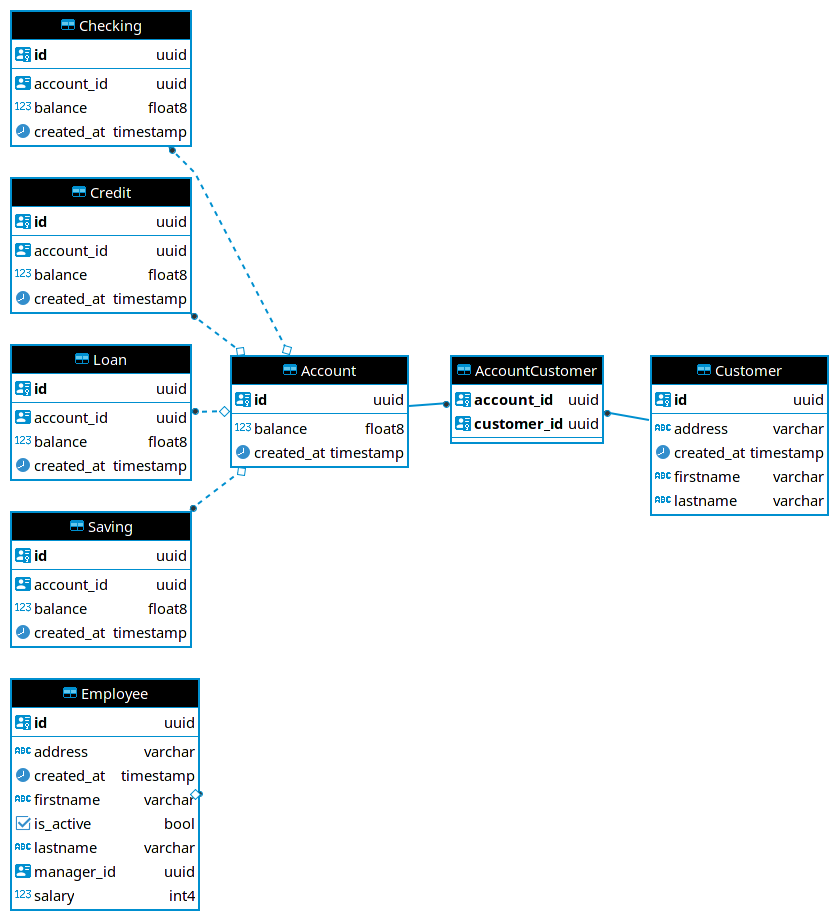

A mock banking app. To use, run the package directly `python -m banking` or
install via pip and use the `banking` executable. There are four commands:
`account`, `service`, `customer`, and `employee`, for operating on various parts
of the business. Running a command without arguments will present you with a
help menu including available subcommands (`python -m banking employee`).

## TODO

- [X] Data model
- [X] Functionality
- [X] Organize
- [X] Logging
- [X] Documentation
- [X] Testing

## Technologies

- [Python 3](https://www.python.org/)
- [PostgreSQL](https://www.postgresql.org/) for data persistence
- [Click](https://click.palletsprojects.com/en/8.0.x/) for the command line interface
- [SQLAlchemy](https://www.sqlalchemy.org/) for object-relational mapping
- [pytest](https://docs.pytest.org/en/6.2.x/) for testing

## Data model

`Employee.manager_id` is a self-referential foreign key to `Employee.id`, to
model the relationship between managers and reports.

Because customers and accounts have a many to many relationship, they are
modeled with a junction table `AccountCustomer`.

